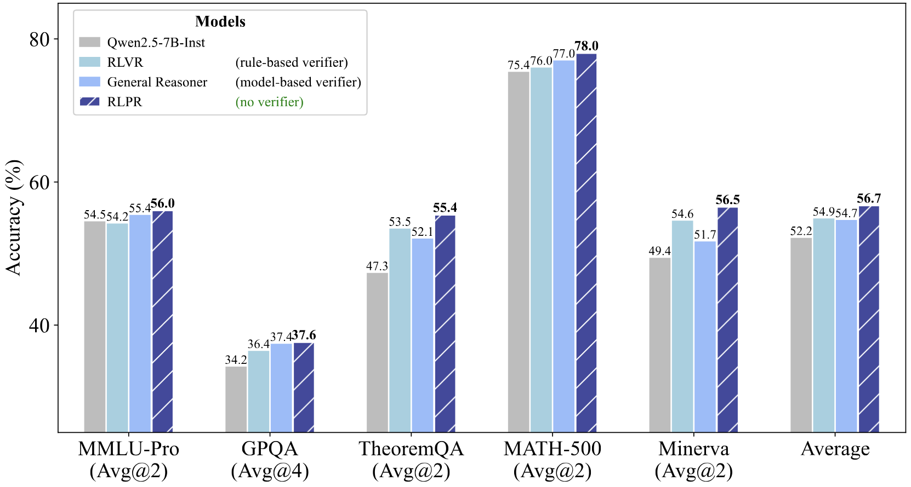
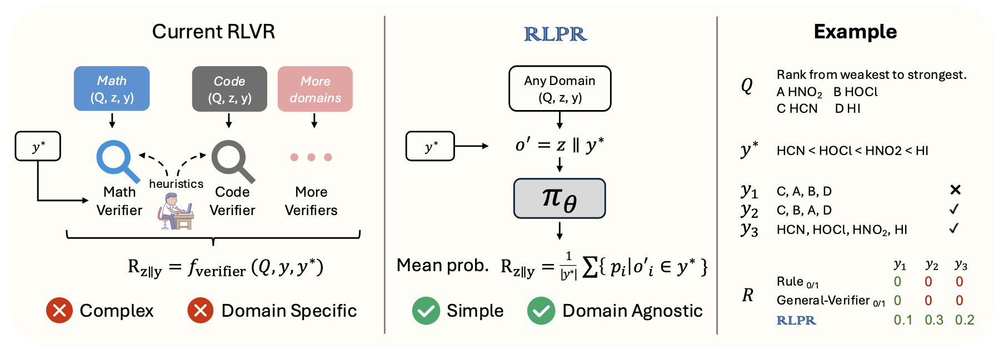
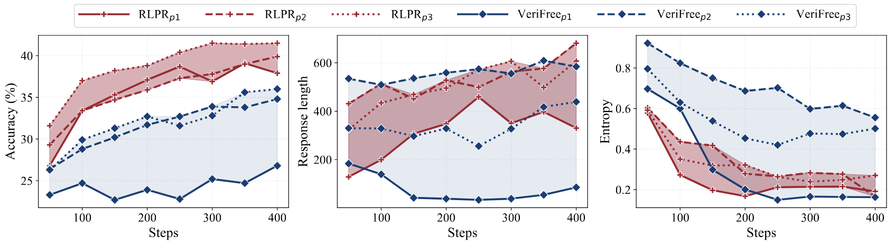

<div align="center">

# RLPR: Scaling RLVR To General Domain

</div>

<div align="center" style="font-size: 15pt">

<a href='https://arxiv.org'></a>
<a href='https://huggingface.co/datasets'></a>
<a href='https://huggingface.co'></a>

<h4 align="center">
    <p>
        <b>中文</b> | <a href="README.md">English</a>
    </p>
</h4>

</div>

## 🎊 更新日志 <!-- omit in toc -->

- [2025.06.23] 我们开源了 RLPR 的代码、[权重](https://huggingface.co)和[数据](https://huggingface.co/datasets)！

## 📜 简介 <!-- omit in toc -->

我们提出了 RLPR (Reinforcement Learning with Reference Probability Reward) 框架，以增强大语言模型 (LLM) 的推理能力。RLPR 使用 LLM 的生成概率作为奖励信号，消除了对外部验证器的依赖。这种方法能够以更高的效率和更广泛的适用性，在通用领域实现稳健的推理能力提升。RLPR 的显著特点包括：

* 💡 **更出色的推理增强**。
    RLPR 在数学和通用领域推理基准测试中均取得了更优秀的推理能力增强效果，甚至超越了使用验证器模型的方法。

<div align="center">  </div>

* 🛠️ **简单且可扩展的奖励机制**。
    RLPR 采用了一种高效的基于概率的奖励 (PR) 机制，其使用参考答案的平均解码概率。我们只需通过单次前向传播即可计算奖励，而无需费力构建基于规则的验证器。

<div align="center">  </div>

* 🚀 **更高的奖励质量和稳健的训练效果**。
    与基于规则、基于模型的奖励以及朴素似然作为奖励相比，PR展现出更高的奖励质量。我们将 RLPR 应用于不同的训练提示模板，发现它均能实现稳健的推理能力增强。

<div align="center">  </div>

<div align="center">  </div>

## 📌 目录 <!-- omit in toc -->

- [RLPR: Scaling RLVR To General Domain](#rlpr-scaling-rlvr-to-general-domain)
  - [数据集](#数据集)
  - [安装](#安装)
  - [训练](#训练)
  - [评估](#评估)
  - [引用](#引用)

## 数据集

我们提供了 [RLPR 训练数据集](https://huggingface.co/) 和 [评估基准](https://huggingface.co/) 以方便使用。

## 安装

1.  克隆本仓库并进入 RLPR 文件夹
    ```bash
    git clone 
    cd RLPR
    ```

2.  安装依赖包
    ```bash
    bash setup_env.sh
    ```

<!-- ## 模型权重

| 模型      | 描述      |           下载链接           |
| --------- | --------- | :--------------------------: |
| RLPR 7B   |   占位符    | [🤗](https://huggingface.co) | -->

## 训练

1.  准备数据

    下载[训练](https://huggingface.co/)和[测试](https://huggingface.co/)数据集。将 `rlpr_train.parquet` 移动到 `./datasets/train` 目录下，并将所有测试数据集移动到 `./datasets/test` 目录下。

2.  在 `examples/scalable_rl/reproduce.sh` 中指定基座模型路径。
    ```bash
    MODEL=path_to_base_model
    ```

3.  (可选) 如果您想使用 wandb 进行日志记录，请登录 wandb 并在 `examples/scalable_rl/reproduce.sh` 中将 `USE_WANDB` 设置为 `True`。

    ```bash
    : "${USE_WANDB:=true}"
    ```

4.  (可选) 如果您想使用大语言模型作为评估 (llm as a judge) 的评估方法，请按照以下步骤操作。如果您想使用基于规则的验证器来判断答案，您可以跳过此步骤。
    *   开源模型作为评估
        1.  创建一个新环境并用其部署模型。(在 `setup_server.sh` 中指定评估模型、主机和端口)

            ```shell
            bash setup_server.sh
            ```

        2.  在 `examples/scalable_rl/reproduce.sh` 中指定评估模型。

            ```shell
            export CLIENT_IP=http://127.0.0.1:8001
            export USED_MODEL=Qwen/Qwen2.5-72B-Instruct
            ```
    *   基于 API 的模型 (gpt-4o / gpt-4.1) 作为评估

        在 `examples/scalable_rl/reproduce.sh` 中设置token和评估模型以使用 OpenAI API。

        ```shell
        export OPENAI_API_KEY=your_api_token
        export OPENAI_API_BASE=your_api_base  # default is https://api.openai.com/v1
        export USED_MODEL=gpt-4.1
        ```

5.  运行训练脚本

    ```shell
    bash examples/scalable_rl/reproduce.sh
    ```

## 评估

1.  遵循[训练](#训练)部分中的步骤 1~4 准备数据、模型和评估模型（可选）。

2.  运行评估脚本

    ```shell
    bash examples/scalable_rl/reproduce.sh +trainer.val_only=True
    ```

## 许可证 <!-- omit in toc -->

[](https://github.com/tatsu-lab/stanford_alpaca/blob/main/LICENSE)
[](https://github.com/tatsu-lab/stanford_alpaca/blob/main/DATA_LICENSE)

**使用和许可声明**：数据、代码和模型仅供研究使用。数据集为 CC BY NC 4.0（仅允许非商业用途），使用该数据集训练的模型不得用于研究目的之外的用途。

## 致谢 <!-- omit in toc -->

- [veRL](https://github.com/volcengine/verl)：本项目基于的代码库。

## 引用

如果您觉得我们的模型/代码/数据/论文有帮助，请给我们 ⭐ 和 引用 📝，感谢！

```bibtex
@article{yu2025rlpr,
  title={RLPR: Extrapolating RLVR to General Domain without Verifiers},
  author={Yu, Tianyu and Ji, Bo and Wang, Shouli and Yao, Shu and Wang, Zefan and Cui, Ganqu and Yuan, Lifan and Ding, Ning and Yao, Yuan and Liu, Zhiyuan and Sun, Maosong and Chua, Tat-Seng},
  journal={arXiv preprint arXiv:2506.xxxxx},
  year={2025}
}
```